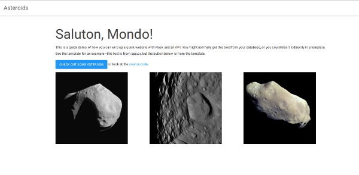
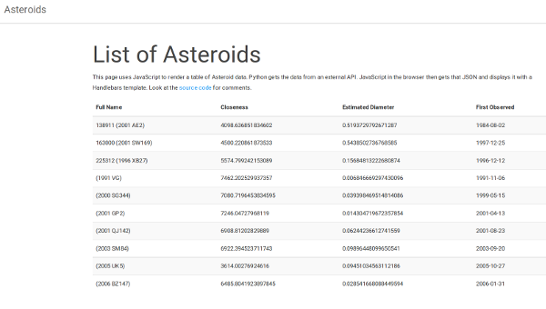

Sample App
==========

I put together this quick Flask site to demo some things that people asked about at the past couple of meetups.

* Building a quick Flask site with Bootstrap/Bootswatch and [a CDN](http://cdnjs.com/).
* Getting data from an API with Python.
* Making an AJAX request with JavaScript
* Rendering JSON data with JavaScript templates (Handlebars.js in this case).

To run this site on your computer:

1. Clone this repo.
1. Make a Python 3 virtualenv. See below for details.
1. Activate the virtualenv.
1. Install the requirements into your virtualenv with `pip install -r requirements.txt`
1. Run the server: `python app.py`
1. Visit [http://localhost:5005/](http://localhost:5005/)

## Python 3 Virtualenvs

On Ubuntu, I use this command, which I've aliased to `mkve3`:

    mkvirtualenv --python=`which python3`

Alternatively, I think that you could use Python 3's [venv feature](https://docs.python.org/3/library/venv.html).

## Exercises

Exercise ideas:

1. Go to [this API directory](http://www.programmableweb.com/apis/directory) and find a different API.
1. Edit the API request in `app.py` to point to the other API.
1. Edit the Handlebars template in `templates/asteroids.html` to display the new data in a table.
1. After that is working, change the name of the `templates/asteroids.html` to something that matches your new site concept.
1. Wire `app.py` together with your new template name and be sure that everything still works. You'll probably want to change the URLs too.
1. Check the Flask docs on how to implement dynamic URLs. For example, you might want to have the option to fetch five asteroids with `/asteroids/5`, or 10 asteroids with `/asteroids/10`.

Hint:

    @app.route('/api/asteroids/<int:num_of_asteroids>')
    def asteroids_api(num_of_asteroids):
        // Build the API query by inserting the num_of_asteroids into your request

## Questions?

If you have questions, you can post them in <a href="http://codeselfstudy.com/forum">the forum</a> or ask them at <a href="http://www.meetup.com/codeselfstudy/">our next meetup</a>.

## Improvements?

Want to make this demo better? Make a pull request.

## Copyrights

The included images of asteroids are from NASA and are in the public domain.

## Screenshots

